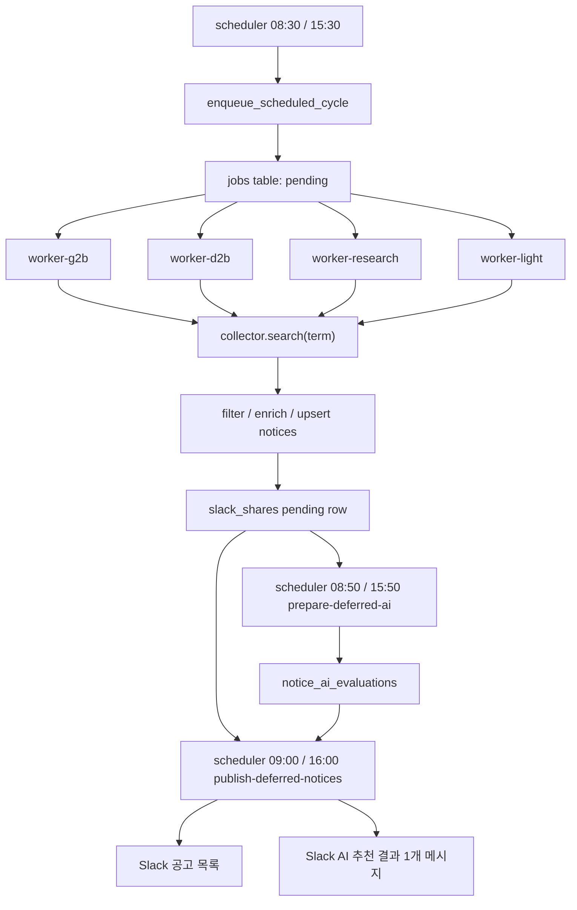

# Biz Monitor 전체 구조 설명

작성일: 2026-07-07  
운영 경로: `/home/koast/biz-monitor`  
운영 서버: `192.168.3.60`

이 문서는 공고 검색 시스템을 처음 보는 사람이 현재 구조를 이해하고, 안전하게 수정/배포/검증할 수 있도록 정리한 운영 기준 문서다.

## 1. 시스템 목적

Biz Monitor는 여러 공고 사이트를 키워드로 검색하고, 회사와 관련 있는 공고만 Slack에 올리는 시스템이다.

주요 기능은 다음과 같다.

- 사이트별 공고 수집: 나라장터(g2b), 방위사업청(d2b), IRIS, KMITI, KIMST, NIA
- 규칙 기반 필터링: 키워드, 제외어, 마감일, 공고 유형, 우선순위 점수
- 첨부/요약 수집: g2b/d2b 등 필요한 사이트에서 첨부파일 및 요약 정보 수집
- Slack 게시: 공고 목록은 정해진 게시 시각에만 전송
- AI 추천: 게시 직전 최대 30건을 평가하고, 사이트별이 아닌 1개 메시지로 합산 게시
- DB 기반 중복 방지: 이미 공유한 공고는 재게시하지 않음
- DB 백업 포함 배포: 배포 중 DB가 줄어들면 자동 복구

## 2. 현재 운영 정책

현재 정책은 "수집 시간"과 "게시 시간"을 분리한다.

| 구분 | 오전 | 오후 |
| --- | --- | --- |
| 공고 수집 시작 | 08:30 | 15:30 |
| AI 평가 준비 | 08:50 | 15:50 |
| Slack 게시 | 09:00 | 16:00 |

세부 정책:

- 공고 목록은 09:00, 16:00에만 Slack에 게시한다.
- worker는 Slack에 직접 게시하지 않고 DB에 게시 대기 상태만 기록한다.
- AI 평가는 게시 10분 전 최대 30건만 처리한다.
- AI 추천 결과는 사이트별로 나누지 않고 1개 Slack 메시지로 합쳐서 게시한다.
- 게시 시각에 아직 검색/평가가 끝나지 않은 공고는 다음 게시 주기로 넘어간다.
- 수동 재실행은 기본적으로 DB만 채우고 Slack에는 올리지 않는 방식으로 운영한다.
- 주말/공휴일 skip 정책은 유지한다.

## 3. Docker 서비스 구조

운영은 Docker Compose 기준이다.

| 서비스 | 역할 |
| --- | --- |
| `biz-monitor-web` | 웹 UI/API. 첨부 다운로드, 캘린더/저장 공고 화면 제공. 포트 `8080`. |
| `biz-monitor-slack` | Slack Socket Mode 명령 처리. 수동 검색/명령 응답 담당. |
| `biz-monitor-scheduler` | 정해진 시각에 job enqueue, AI 준비, Slack 게시를 수행. |
| `biz-monitor-worker-g2b` | 나라장터(g2b) 전용 수집 worker. 느리고 첨부/상세 처리가 많아서 분리. |
| `biz-monitor-worker-d2b` | 방위사업청(d2b) 전용 수집 worker. |
| `biz-monitor-worker-research` | `iris,kmiti` 수집 worker. |
| `biz-monitor-worker-light` | `kimst,nia` 수집 worker. |

현재 worker 분리는 `docker-compose.yml`의 `SCHEDULER_SITE_CODES`로 결정된다.

```text
biz-monitor-worker-g2b      -> g2b
biz-monitor-worker-d2b      -> d2b
biz-monitor-worker-research -> iris,kmiti
biz-monitor-worker-light    -> kimst,nia
```

## 4. 전체 데이터 흐름



핵심은 worker가 Slack 전송을 직접 하지 않는다는 점이다. worker는 수집과 DB 기록만 담당하고, `biz-monitor-scheduler`가 게시 시각에 DB를 읽어 Slack으로 보낸다.

## 5. 주요 코드 위치

| 파일 | 역할 |
| --- | --- |
| `app/main.py` | CLI entrypoint. scheduler loop, worker loop, 수동 명령 실행. |
| `app/config.py` | `.env`, `.env.override` 로딩 및 `Settings` 정의. |
| `app/bootstrap.py` | DB schema 생성/마이그레이션. |
| `app/models.py` | SQLAlchemy 모델 정의. |
| `app/collectors/*.py` | 사이트별 검색 구현. `search(term)`이 `NoticeCandidate` 목록 반환. |
| `app/services/scheduler.py` | enqueue, worker 처리, deferred publish, AI 준비/게시 핵심 로직. |
| `app/services/business_scope_filter.py` | 제외어/회사 범위 필터. |
| `app/services/relevance.py` | 규칙 기반 관련성 판정. |
| `app/services/notice_meta.py` | 우선순위 점수, 표시용 메타 보강. |
| `app/services/ai_relevance.py` | AI gateway 호출 및 AI 평가 저장. |
| `app/services/notifier.py` | Slack 메시지 포맷/전송. |
| `app/repositories/jobs.py` | job claim, heartbeat, stale requeue. |
| `app/repositories/shares.py` | Slack 공유 이력/게시 대기 row 관리. |
| `app/repositories/ai_evaluations.py` | AI 평가 이력 저장/게시 표시. |
| `docker/run-scheduler.sh` | scheduler 컨테이너 시작 명령. |
| `docker/run-worker.sh` | worker 컨테이너 시작 명령. |
| `scripts/deploy-with-db-backup.sh` | DB 백업 포함 운영 배포 스크립트. |

## 6. 설정 파일 우선순위

컨테이너는 다음 순서로 환경 파일을 읽는다.

```text
.env
.env.override
```

같은 키가 있으면 `.env.override` 값이 우선이다. 운영 변경은 가급적 `.env.override`에 넣는다.

주요 설정:

| 설정 | 현재 의미 |
| --- | --- |
| `SCHEDULE_TIME_1=08:30` | 오전 수집 enqueue 시각. |
| `SCHEDULE_TIME_2=15:30` | 오후 수집 enqueue 시각. |
| `SLACK_DEFERRED_PUBLISH_ENABLED=true` | worker 직접 게시를 막고 게시 전용 scheduler가 전송. |
| `SLACK_PUBLISH_TIME_1=09:00` | 오전 Slack 게시 시각. |
| `SLACK_PUBLISH_TIME_2=16:00` | 오후 Slack 게시 시각. |
| `AI_RELEVANCE_PREPARE_MINUTES_BEFORE_PUBLISH=10` | 게시 10분 전 AI 평가 준비. |
| `AI_RELEVANCE_MAX_PER_RUN=30` | 게시 주기당 AI 평가 최대 30건. |
| `SLACK_DEFERRED_PUBLISH_SINCE` | deferred 게시 전환 이후 데이터만 AI 추천 대상으로 보는 기준 시각. |
| `CALENDAR_WEB_URL=http://192.168.3.60:8080/calendar` | Slack 메시지/웹 링크 기준 URL. |
| `SCHEDULER_SKIP_WEEKENDS=true` | 주말 skip. |
| `SCHEDULER_SKIP_PUBLIC_HOLIDAYS=true` | 공휴일 skip. |
| `EXCLUDED_SCOPE_KEYWORDS` | 제목/본문에 있으면 Slack 공유 제외할 단어 목록. |
| `G2B_KEYWORDS`, `NIA_KEYWORDS` 등 | 사이트별 검색 키워드. |

## 7. DB 테이블 구조와 의미

SQLite DB 경로:

```text
/home/koast/biz-monitor/data/app.db
```

주요 테이블:

| 테이블 | 의미 |
| --- | --- |
| `sites` | 사이트 코드/활성 상태. |
| `jobs` | 검색 작업 큐. `pending/running/success/failed/skipped`. |
| `notices` | 수집된 공고 원본/정규화 정보. |
| `slack_shares` | Slack 공유 이력 및 deferred 게시 대기 상태. |
| `notice_ai_evaluations` | AI 평가 결과와 AI 추천 메시지 게시 여부. |
| `notice_attachments` | 다운로드된 첨부파일 메타. |
| `notice_summaries` | 첨부/본문 요약 결과. |
| `calendar_saved_notices` | 캘린더/저장 공고 관련 데이터. |

deferred 게시에서 중요한 상태:

- `slack_shares.message_ts`가 비어 있으면 Slack 게시 대기 상태다.
- Slack 게시가 성공하면 `message_ts`가 채워진다.
- `notice_ai_evaluations.ai_recommendation_posted_at`이 비어 있으면 AI 추천 메시지에 아직 포함되지 않은 상태다.

## 8. 스케줄러 동작

`biz-monitor-scheduler`는 `python -m app.main run-scheduler-loop`를 실행한다.

반복 루프에서 하는 일:

1. 운영일인지 확인한다.
2. `08:30/15:30`이면 `enqueue_scheduled_cycle()`로 검색 job을 만든다.
3. `08:50/15:50`이면 `prepare_deferred_ai_evaluations()`로 AI 평가를 최대 30건 수행한다.
4. `09:00/16:00`이면 `publish_deferred_scheduled_notices()`로 Slack에 공고 목록과 AI 추천 1개 메시지를 게시한다.

상태 파일:

```text
/home/koast/biz-monitor/data/scheduler-state-enqueue-enqueue
/home/koast/biz-monitor/data/scheduler-state-ai-prepare-enqueue
/home/koast/biz-monitor/data/scheduler-state-publish-enqueue
```

이 파일들은 같은 시각 작업이 재시작 후 중복 실행되지 않도록 마지막 실행 mark를 저장한다.

## 9. Worker 동작

worker는 `python -m app.main run-worker-loop`를 실행한다.

worker 처리 순서:

1. 자신의 `SCHEDULER_SITE_CODES` 범위에 맞는 pending job을 claim한다.
2. heartbeat를 찍어 장기 실행 작업이 stale로 오인되지 않게 한다.
3. collector로 사이트 검색을 실행한다.
4. 채용/제외어/마감/관련성/우선순위 필터를 적용한다.
5. 공고를 `notices`에 upsert한다.
6. deferred publish 모드에서는 Slack에 보내지 않고 `slack_shares`에 `message_ts=""`로 대기 row를 만든다.
7. job을 success/failed/skipped로 마무리한다.

주의:

- `SLACK_DEFERRED_PUBLISH_ENABLED=true`일 때 worker는 Slack 공고 목록을 직접 보내면 안 된다.
- 수동 재실행이나 backfill은 `--backfill-only`로 실행해 Slack 재게시를 막는다.

## 10. AI 추천 구조

AI 평가는 OpenClaw gateway를 통해 수행된다.

현재 호출 흐름:

```text
biz-monitor
  -> AI_RELEVANCE_GATEWAY_URL=http://host.docker.internal:8091/v1/agent
  -> OpenClaw cron-google agent
  -> provider priority: NVIDIA GLM / internal Qwen / Gemini fallback
```

AI 평가는 `app/services/ai_relevance.py`에서 수행하고, 결과는 `notice_ai_evaluations`에 저장된다.

게시 규칙:

- 게시 10분 전까지 완료된 평가만 우선 반영한다.
- timeout/failed는 공고 목록 게시를 막지 않는다.
- AI 추천 메시지에는 미완료 건수를 "다음 게시 주기에 다시 평가/게시"로 표시한다.
- AI 추천 메시지가 Slack에 올라가면 해당 평가 row의 `ai_recommendation_posted_at`이 채워진다.

## 11. 필터링 구조

공고가 Slack에 올라가기 전 대략 다음 필터를 거친다.

1. 사이트별 키워드 검색 결과 수집.
2. 채용 공고 제외: `app/services/recruitment_filter.py`.
3. 회사 범위 제외어: `app/services/business_scope_filter.py`, `EXCLUDED_SCOPE_KEYWORDS`.
4. 마감/게시 기간 확인: `app/services/deadline.py`.
5. 규칙 기반 관련성 확인: `app/services/relevance.py`.
6. 우선순위 점수 보강: `app/services/notice_meta.py`.
7. broad keyword 보정: 유지보수처럼 넓은 단어는 다른 관련 키워드와 같이 잡힌 경우만 허용.

수정 포인트:

- 검색어 추가/삭제: `.env.override`의 `G2B_KEYWORDS`, `NIA_KEYWORDS` 등 수정.
- 완전 제외어 추가: `.env.override`의 `EXCLUDED_SCOPE_KEYWORDS` 수정.
- 필터 로직 자체 수정: `app/services/business_scope_filter.py`, `app/services/relevance.py`, `app/services/notice_meta.py`.
- 사이트별 특수 마감 로직: `app/services/deadline.py`.

## 12. 나라장터(g2b) 특이사항

g2b는 가장 느리고 복잡한 사이트다.

특이사항:

- 별도 worker `biz-monitor-worker-g2b`로 분리되어 있다.
- 본 공고, 사전규격, 발주계획 성격의 공고가 섞일 수 있다.
- 금액/첨부/상세 URL 수집이 중요하다.
- 첨부 수집과 상세 페이지 접근 실패가 전체 배치를 막지 않도록 worker 분리가 필요하다.
- 본 공고는 일정 기간이 지나면 retention/마감 필터로 정리한다.

g2b 관련 수정 시 우선 확인할 파일:

```text
app/collectors/g2b.py
app/services/scheduler.py
app/services/deadline.py
app/services/attachments.py
app/services/notice_amounts.py
```

## 13. 수동 운영 명령

모든 명령은 운영 서버에서 실행한다.

```bash
cd /home/koast/biz-monitor
```

서비스 상태:

```bash
docker compose ps
docker compose logs --since=10m biz-monitor-scheduler
docker compose logs --since=10m biz-monitor-worker-g2b
docker compose logs --since=10m biz-monitor-worker-d2b
docker compose logs --since=10m biz-monitor-worker-research
docker compose logs --since=10m biz-monitor-worker-light
```

현재 설정 확인:

```bash
docker compose exec -T biz-monitor-scheduler python -m app.main show-config
```

DB 백업:

```bash
docker compose exec -T biz-monitor-slack python -m app.main backup-db
```

수동 enqueue:

```bash
docker compose exec -T biz-monitor-scheduler python -m app.main enqueue-scheduled-jobs
```

수동 worker 처리, Slack 미전송:

```bash
docker compose exec -T biz-monitor-scheduler python -m app.main run-pending-jobs --backfill-only
```

수동 AI 준비:

```bash
docker compose exec -T biz-monitor-scheduler python -m app.main prepare-deferred-ai --limit 30
```

수동 deferred 게시:

```bash
docker compose exec -T biz-monitor-scheduler python -m app.main publish-deferred-notices
```

주의: `publish-deferred-notices`는 실제 Slack에 게시한다. 빈 큐 smoke test가 아니라면 운영 게시 시각 외에는 신중하게 실행한다.

## 14. 배포 절차

표준 배포는 DB 백업 포함 스크립트를 사용한다.

```bash
cd /home/koast/biz-monitor
./scripts/deploy-with-db-backup.sh
```

이 스크립트가 하는 일:

1. 배포 전 DB integrity check.
2. `data/backups/app-predeploy-YYYYMMDD-HHMMSS.db` 생성.
3. Docker image rebuild.
4. 주요 서비스 force recreate.
5. 배포 후 DB integrity check.
6. 테이블 수 또는 공고 수가 줄면 DB 자동 복구 후 실패 처리.

수동으로 `docker compose up`만 실행하지 않는 것이 좋다. DB가 날아가거나 비정상 초기화된 경우를 놓칠 수 있다.

## 15. 테스트/검증

운영 이미지 기준 테스트:

```bash
cd /home/koast/biz-monitor
docker compose exec -T biz-monitor-slack python -m unittest -v tests.test_scheduler_regression < /dev/null
```

문법 검사:

```bash
docker compose exec -T biz-monitor-slack python -m py_compile \
  app/config.py app/models.py app/bootstrap.py \
  app/repositories/ai_evaluations.py \
  app/services/scheduler.py app/main.py < /dev/null
```

DB 상태 확인:

```bash
python3 - <<'PY'
import sqlite3
con = sqlite3.connect('/home/koast/biz-monitor/data/app.db')
print(con.execute("select status, count(*) from jobs group by status order by status").fetchall())
print("pending_shares=", con.execute("select count(*) from slack_shares where coalesce(message_ts,'')=''").fetchone()[0])
print("ai_unposted=", con.execute("select count(*) from notice_ai_evaluations where ai_recommendation_posted_at is null").fetchone()[0])
PY
```

배포 후 합격 기준:

- 모든 Docker 서비스가 `running`.
- `show-config`에서 `SCHEDULE_TIMES=08:30,15:30`.
- `SLACK_DEFERRED_PUBLISH_ENABLED=True`.
- `SLACK_PUBLISH_TIMES=09:00,16:00`.
- `AI_RELEVANCE_MAX_PER_RUN=30`.
- 회귀 테스트 통과.
- DB notices 수가 배포 전보다 줄지 않음.

## 16. 새 사이트를 추가하는 방법

1. `app/collectors/{site}.py`에 collector 추가.
2. `app/collectors/__init__.py`의 `build_collector_registry()`에 등록.
3. `app/config.py`에 `SITE_{SITE}_ENABLED`, `{SITE}_KEYWORDS` 로딩 추가.
4. `.env.override`에 사이트 활성화/키워드 추가.
5. 필요하면 `docker-compose.yml`에서 worker scope에 사이트 코드 추가.
6. 사이트별 마감/금액/첨부 특수 로직이 필요하면 `deadline.py`, `notice_amounts.py`, `attachments.py`에 추가.
7. 회귀 테스트 추가.

## 17. 검색어/제외어 수정 방법

검색어는 `.env.override`에서 수정한다.

예:

```text
G2B_KEYWORDS=기상정보,해양관측,양식,테스트베드
NIA_KEYWORDS=AI,데이터,공간정보,GIS
```

제외어는 `EXCLUDED_SCOPE_KEYWORDS`에 추가한다.

예:

```text
EXCLUDED_SCOPE_KEYWORDS=조경,수목,도로포장,폐기물,청소
```

수정 후 적용:

```bash
cd /home/koast/biz-monitor
./scripts/deploy-with-db-backup.sh
docker compose exec -T biz-monitor-scheduler python -m app.main show-config
```

## 18. 장애 대응 체크리스트

공고가 Slack에 안 올라올 때:

1. PC/서버가 켜져 있고 SSH 되는지 확인.
2. `docker compose ps`로 컨테이너 상태 확인.
3. scheduler 로그에서 enqueue/prepare/publish 시각 로그 확인.
4. worker 로그에서 claim/search/filter 오류 확인.
5. `jobs` 테이블에 `pending/running`이 남았는지 확인.
6. `slack_shares`에 `message_ts=""` 대기 row가 있는지 확인.
7. Slack token/API 오류 로그 확인.

AI 추천만 안 올라올 때:

1. `AI_RELEVANCE_ENABLED=true` 확인.
2. `AI_RELEVANCE_GATEWAY_URL` 확인.
3. OpenClaw gateway `8091` 상태 확인.
4. `notice_ai_evaluations`에 failed/timeout이 쌓이는지 확인.
5. `ai_recommendation_posted_at`이 이미 채워져 중복 방지된 것인지 확인.

과거 공고가 다시 올라올 때:

1. DB가 복구/초기화되었는지 확인.
2. `slack_shares` 이력이 유지되는지 확인.
3. `SLACK_DEFERRED_PUBLISH_SINCE`가 너무 과거인지 확인.
4. 사이트 collector가 오래된 공고를 최신처럼 반환하는지 확인.
5. retention/마감 필터가 적용되는지 확인.

## 19. 수정 시 주의사항

- DB schema 변경은 additive migration으로만 처리한다. 기존 컬럼 삭제/테이블 재생성은 피한다.
- 배포 전 반드시 DB 백업이 있는지 확인한다.
- worker에서 Slack 전송을 다시 켜지 않는다. 게시 권한은 scheduler publish 단계에만 둔다.
- 수동 재수집은 `--backfill-only`를 우선 사용한다.
- AI timeout은 공고 목록 게시를 막으면 안 된다.
- `.env`에는 비밀값이 있을 수 있으므로 문서나 커밋에 토큰을 복사하지 않는다.
- 운영 서버 기준 테스트는 컨테이너 안에서 실행한다. 호스트 Python에는 의존성이 없을 수 있다.

## 20. 빠른 운영 요약

일상 확인:

```bash
cd /home/koast/biz-monitor
docker compose ps
docker compose logs --since=30m biz-monitor-scheduler
docker compose exec -T biz-monitor-scheduler python -m app.main show-config
```

안전 배포:

```bash
cd /home/koast/biz-monitor
./scripts/deploy-with-db-backup.sh
docker compose exec -T biz-monitor-slack python -m unittest -v tests.test_scheduler_regression < /dev/null
```

DB만 채우는 재실행:

```bash
cd /home/koast/biz-monitor
docker compose exec -T biz-monitor-scheduler python -m app.main run-pending-jobs --backfill-only
```

게시 전용 수동 실행:

```bash
cd /home/koast/biz-monitor
docker compose exec -T biz-monitor-scheduler python -m app.main prepare-deferred-ai --limit 30
docker compose exec -T biz-monitor-scheduler python -m app.main publish-deferred-notices
```

## 21. Git 버전관리 기준

운영 경로 `/home/koast/biz-monitor`는 git repo로 관리한다.

추적 대상:

- `app/`, `docker/`, `scripts/`, `tests/`, `docs/`
- `docker-compose.yml`, `Dockerfile`, `requirements.txt`, `.env.example`

추적 제외 대상:

- `.env`, `.env.override`: Slack/OpenClaw 토큰 등 비밀값 포함 가능
- `data/`: SQLite DB, scheduler state, DB 백업
- `output/`: 로그, 다운로드 파일, 임시 분석 결과
- `.venv/`, `__pycache__/`, `tmp/`, `backups/`

운영 변경 전후 확인:

```bash
cd /home/koast/biz-monitor
git status --short
git diff --stat
```

운영 변경을 확정할 때:

```bash
git add .
git commit -m "Describe the operational change"
```

주의: `.env`나 `data/app.db`가 `git status`에 올라오면 `.gitignore`가 깨진 것이므로 커밋하지 않는다.

## 22. 영속 로그 기준

컨테이너 stdout 로그는 재생성 시 사라질 수 있으므로 장애 분석에는 파일 로그를 우선 사용한다.

파일 로그 위치:

```text
/home/koast/biz-monitor/output/logs/
```

서비스별 로그 파일:

```text
web.log
slack.log
scheduler.log
worker-g2b.log
worker-d2b.log
worker-research.log
worker-light.log
```

로그 정책:

- 로그는 Docker bind mount인 `output/logs`에 저장된다.
- 각 서비스는 자기 파일에만 기록한다.
- 로그는 매일 자정 회전한다.
- 기본 보존 기간은 14일이다. `LOG_BACKUP_DAYS`로 조정한다.

장애 확인 예:

```bash
cd /home/koast/biz-monitor
tail -200 output/logs/scheduler.log
tail -200 output/logs/worker-g2b.log
grep -R "ERROR\\|Timeout\\|failed" output/logs/*.log | tail -100
```
