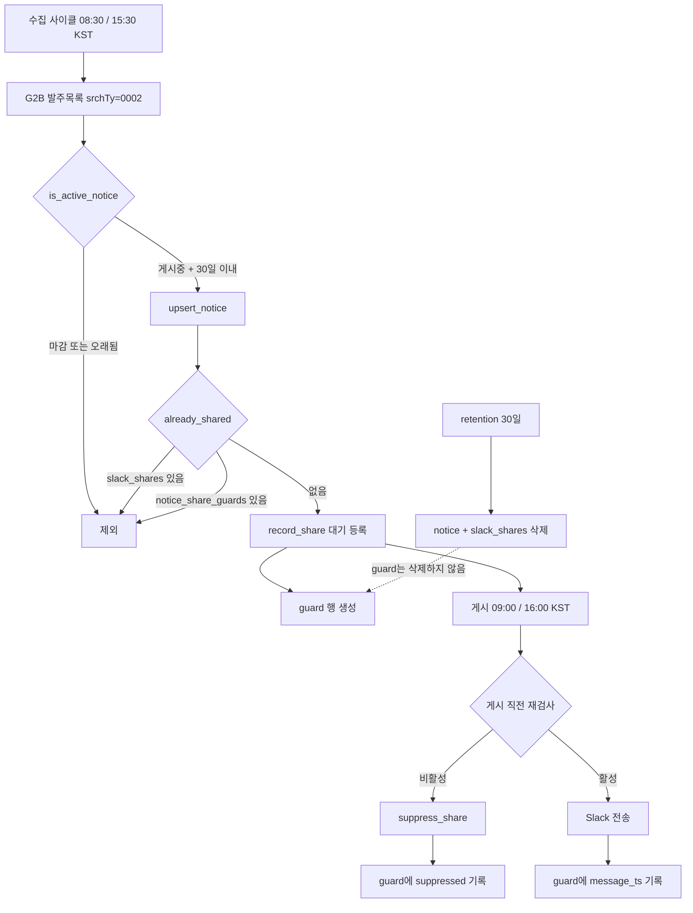

# 사전규격 라벨 정정 및 재게시 방지 작업 인수인계

> [!important]
> 2026-07-30 오전에 운영 서버(`192.168.3.60`, `/home/koast/biz-monitor`)에 배포된 세 건의 변경에 대한 기록입니다.
> 문제가 생겼을 때 무엇을 되돌려야 하는지는 [[#롤백 절차]]와 [[#증상별 대처]]를 보세요.
>
> [!warning]
> 후속 안전 보완(백업 기반 guard backfill, retention 보존 범위 축소, 배포 검증 수정)은
> 2026-07-30에 운영 서버에 반영됐습니다 (`5e4c302`).

## 목차

- [[#한눈에 보기]]
- [[#전체 구성도]]
- [[#배경]]
- [[#변경 1 · retention 보호 규칙]]
- [[#변경 2 · 재게시 방지 guard 테이블]]
- [[#변경 3 · 사전규격 라벨 정정]]
- [[#조사 근거]]
- [[#검증 기록]]
- [[#백업 목록]]
- [[#롤백 절차]]
- [[#증상별 대처]]
- [[#관측 포인트]]
- [[#남은 작업]]
- [[#알려진 함정]]

## 한눈에 보기

| 항목 | 내용 |
| --- | --- |
| 대상 시스템 | biz-monitor (조달·연구공고 수집 후 Slack 공유) |
| 운영 서버 | `koast@192.168.3.60`, `/home/koast/biz-monitor` |
| 브랜치 | `main` (원격 `git@github.com:yhcho870831/biz-monitor.git`) |
| 작업 전 커밋 | `fe900d5` |
| 작업 후 커밋 | `89da0bb` |
| 배포 방식 | `bash scripts/deploy-with-db-backup.sh` (3회) |
| DB | SQLite WAL 모드, `data/app.db` |
| 서비스 | Docker Compose 7개 컨테이너 |

커밋 3건이 추가됐습니다.

| 커밋 | 시각(KST) | 내용 |
| --- | --- | --- |
| `5bdaf9d` | 10:45 | retention이 제외 이력을 지우지 않도록 보호 |
| `7de4cc2` | 10:51 | `notice_share_guards` 테이블로 재게시 영구 차단 |
| `89da0bb` | 11:31 | 발주계획 → 사전규격 라벨·stage 정정, 링크 수정 |

> [!note]
> `89da0bb`는 원래 `bfd846c`였습니다. 커밋 메시지의 한글이 깨져서 사용자 요청으로 `--amend` 후
> `--force-with-lease`로 다시 올렸습니다. **코드 트리 해시는 `31fadd0e`로 동일**하며 내용 변화는 없습니다.

## 전체 구성도



## 배경

`AI_검토_가이드.md`를 기준으로 시스템을 점검하면서 시작했습니다. 가이드가 확인하려던 세 가지는 이렇습니다.

1. 마감·종료된 공고가 Slack에 다시 게시·추천되지 않는가
2. 발주계획 / 사전규격 / 입찰공고가 혼동되지 않는가
3. 실행 가능한 공고만 AI가 추천하는가

점검 결과 가이드가 명시한 기대값은 모두 충족했지만, 그 아래에서 두 가지 구조적 문제와 한 가지 사실관계 오류를 발견했습니다.

> [!warning]
> 가이드 3장·5장·6장은 "이 경로의 데이터는 사전규격이 아니라 발주계획"이라는 전제로 쓰여 있습니다.
> **이 전제가 틀렸습니다.** 근거는 [[#조사 근거]]에 있습니다. 가이드 문서는 아직 갱신하지 않았습니다.

## 변경 1 · retention 보호 규칙

### 문제

`delete_expired_notices()`가 30일 지난 공고를 지울 때 연결된 `slack_shares` 행도 함께 지웠습니다.
`slack_shares.notice_id`에 `ondelete="CASCADE"`가 걸려 있어 공고를 지우면 공유 이력이 따라 사라집니다.

여기에는 **제외(suppressed) 감사 기록**도 포함됩니다. 가이드는 "제외된 행은 삭제하지 않고 이력을 남긴다"고
적어두었지만 실제로는 다음 정리 시점에 사라질 예정이었습니다.

측정값: 제외 37건 중 **21건**, 게시 완료 이력 381건 중 **226건**이 다음 사이클에서 삭제 대상이었습니다.

### 조치

처음에는 제외 공유가 달린 공고를 삭제 보호 대상으로 두었습니다. 하지만 이제는
`notice_share_guards`가 제외 시각과 사유를 독립적으로 보존하므로 공고·첨부·스크린샷을 무기한
보관할 필요가 없습니다. retention은 일반 공고와 동일하게 원본 `Notice` 및 `SlackShare`를 지우고,
guard만 남깁니다.

```python
# suppress_share() copies suppressed_at / suppressed_reason to the durable
# guard. Retention can delete the source notice and SlackShare without losing
# either the audit decision or the re-post guard.
```

### 확인 방법

```bash
ssh koast@192.168.3.60
cd /home/koast/biz-monitor
docker compose exec -T biz-monitor-scheduler python -c \
  "import sqlite3; c=sqlite3.connect('file:/app/data/app.db?mode=ro',uri=True); \
   print(c.execute('select count(*) from notice_share_guards where suppressed_at is not null').fetchone()[0])"
```

정리 사이클 이후에는 `slack_shares` 행은 줄어도 guard의 제외 이력은 남아야 합니다.

## 변경 2 · 재게시 방지 guard 테이블

### 문제

`already_shared()`는 `slack_shares` 행의 존재로 "이미 공유했는가"를 판정합니다.
그런데 retention이 공고와 공유 행을 함께 지우므로, **같은 공고가 나중에 다시 수집되면 새 `notice_id`를
받아 이력이 끊기고 Slack에 다시 게시됩니다.**

실제로 위험한 대상을 세어봤습니다. 마감시각도 없고 게시일도 파싱되지 않는 공고가 iris 33건, kimst 3건 있고,
**36건 전부 이미 Slack에 게시된 이력**이 있었습니다. 이 부류는 `is_active_notice()`가 영구히 활성으로
판정하므로, 30일 뒤 삭제되고 재수집되면 그대로 재게시됩니다.

### 조치

`notice_share_guards` 테이블을 새로 만들었습니다. 키를 `notice_id`가 아니라
`(site_code, site_notice_key, channel_id)`로 잡아 공고 생애주기에서 분리했습니다.

| 컬럼 | 용도 |
| --- | --- |
| `site_code`, `site_notice_key`, `channel_id` | 유니크 키 (`uq_notice_share_guard`) |
| `first_shared_at` | 최초 대기 등록 시각 |
| `last_message_ts` | 실제 게시된 Slack 메시지 ts |
| `suppressed_at`, `suppressed_reason` | 제외 사유 감사 기록 |
| `updated_at` | 마지막 갱신 |

- `record_share()`, `suppress_share()`가 guard를 함께 갱신합니다.
- `already_shared()`가 `slack_shares` → guard 순으로 조회합니다.
- **retention은 이 테이블을 건드리지 않습니다.**
- 현재 DB에 남아 있는 이력은 `app/bootstrap.py`의 `_upgrade_schema()`에서 `INSERT OR IGNORE`로 백필합니다.
- retention 전에 이미 삭제된 과거 이력은 라이브 DB만으로 복구할 수 없습니다. 새
  `backfill-share-guards` 명령이 일관된 SQLite 백업을 읽어 guard를 멱등으로 보충합니다. 배포 스크립트가
  이를 자동 실행하며, 필요하면 수동으로도 실행할 수 있습니다.

```bash
docker compose exec -T biz-monitor-scheduler \
  python -m app.main backfill-share-guards --backup-dir /app/data/backups
```

> [!note]
> 호출부 시그니처를 바꾸지 않았기 때문에 `scheduler.py`와 `pipeline.py`는 수정하지 않았습니다.
> guard 조회에 필요한 `site_code`/`site_notice_key`는 `shares.py` 안에서 `Notice`를 조회해 얻습니다.

### 동작 범위 주의

guard는 **한 번 공유된 것은 영구히 다시 공유하지 않습니다.** 기존 `already_shared()` 동작을 retention 너머로
연장한 것이라 정책 변화는 아니지만, 의도적으로 재게시하고 싶은 경우에는 해당 guard 행을 지워야 합니다.

```sql
-- 특정 공고를 다시 게시하고 싶을 때만 사용
DELETE FROM notice_share_guards
 WHERE site_code = 'g2b' AND site_notice_key = 'prespec:R26BD00258247';
```

## 변경 3 · 사전규격 라벨 정정

### 문제

수집기는 나라장터 발주목록 화면에서 `srchTy = "0002"`로 조회합니다. 직전 작업에서 이 데이터를
"발주계획"으로 판단해 Slack 라벨을 `[발주계획]`으로 바꾸고 상세 링크를 제거했습니다.

**이 판단이 틀렸습니다.** `srchTy=0002`는 사전규격공개입니다.

### 조치

| 대상 | 변경 전 | 변경 후 |
| --- | --- | --- |
| Slack 라벨 | `[발주계획]` | `[사전규격]` |
| 일정 필드 | `게시일:` | `공개일:` |
| stage 값 | `procurement_plan` | `pre_specification` |
| 판정 상수 | `G2B_PROCUREMENT_PLAN_STAGES` | `G2B_PRE_SPECIFICATION_STAGES` |
| 판정 함수 | `_is_active_g2b_procurement_plan` | `_is_active_g2b_pre_specification` |
| 링크 | `https://www.g2b.go.kr/` (홈) | 사전규격공개 목록 딥링크 |
| 신규 필드 | 없음 | `사전규격등록번호` |

`app/services/deadline.py`에 근거를 명시한 단일 집합을 두고, 세 모듈이 각자 갖고 있던 중복 상수를
제거했습니다.

```python
# The G2B 발주목록 screen dispatches on srchTy, where 0002 is 사전규격(사전규격공개)
# and 0001 is 발주계획현황. The collector queries 0002, so these rows are
# pre-specifications. "pre_announcement" and "procurement_plan" are earlier
# mislabels of the same route and are kept so stored rows keep working.
G2B_PRE_SPECIFICATION_STAGES = {
    "pre_announcement",
    "procurement_plan",
    "pre_specification",
}
```

> [!tip]
> 옛 stage 값 두 개를 집합에 남겨둔 것이 핵심입니다. 저장된 758건이 그대로 동작하고, 다음 수집에서
> 자연스럽게 `pre_specification`으로 갱신됩니다. **DB 백필이 필요 없습니다.**

링크도 저장된 `source_url`이 아니라 표시 시점에 보정합니다. 그래서 기존 758건도 재수집 없이 바로
올바른 화면을 가리킵니다.

```python
def _display_source_url(candidate: NoticeCandidate) -> str:
    if _announcement_stage(candidate) in G2B_PRE_SPECIFICATION_STAGES:
        return PRE_SPECIFICATION_LIST_URL
    return candidate.source_url or ""
```

### 실제 출력

```
[나라장터] [⬜ 기타] [☆☆☆] <https://www.g2b.go.kr/link/PRCA001_04/single/?srch=0002&flag=cnrtSl|[사전규격] 차세대수소추진선박실증연구센터의 수소추진선박 건조 및 실증 전면 책임감리용역>
발주처: 울산대학교 산학협력단
태그: ⬜ 기타
사전규격등록번호: R26BD00258247
공개일: 2026-07-29 00:00 | 상태: 게시중
금액: 80,000,000원
중요도: ☆☆☆
링크: https://www.g2b.go.kr/link/PRCA001_04/single/?srch=0002&flag=cnrtSl
```

## 조사 근거

라벨을 되돌리려는 사람이 있을 수 있으므로 근거를 남깁니다. 모두 나라장터 화면의 **자체 JavaScript 소스**와
**실제 네트워크 요청**에서 확인한 것입니다.

### 1. 화면이 스스로 붙인 주석

`gridView1_oncellclick` 핸들러의 분기입니다.

| srchTy | G2B 소스 주석 | 상세화면 ID | 상세 파라미터 |
| --- | --- | --- | --- |
| 0001 | `//발주계획현황` | `PRPA015_01` | `oderPlanNo` |
| **0002** | `//사전규격(사전규격공개)` | `PRVA004_02` | `bfSpecRegNo` |
| 0003 | `//제안요청` | `PRPC004_01` | `rfpNo` |
| 0005 | `//외자규격공고` | — | — |
| 0006 | `//사전규격(입찰안내서)` | — | — |

수집기가 쓰는 값은 `0002`입니다. 발주계획은 `0001`이고 코드에서 쓰지 않습니다.

### 2. 필드 이름

`oderPlanNo = R26BD00258247`은 클릭 핸들러에서 `bfSpecRegNo`(사전규격등록번호)로 매핑됩니다.
수집된 payload에도 사전규격 전용 필드가 있습니다.

- `bfSpecRfrnYn` — 사전규격 참조 여부
- `bfSpecOpnnCnt` — 사전규격 의견 등록 건수

### 3. 상세 화면 실물

`https://www.g2b.go.kr/link/PRVA004_02/?paramData=<base64 JSON>`으로 접속하면 화면이 열립니다.
브레드크럼은 `발주목록 > 사전규격상세조회`이고 필드 구성은 이렇습니다.

```
사전규격등록번호 | 발주계획통합번호 | 조달요청접수번호 | 업무구분 | 사전규격명
수요기관 | 공고기관 | 참조번호 | 배정예산액(부가세포함)
의견등록마감일시 | 납품(완수)기한 | 사전규격 공개일시
```

`사전규격등록번호`와 `발주계획통합번호`가 **별개 필드로 나란히** 있습니다.

### 4. 상세 링크를 못 넣은 이유

상세 데이터 엔드포인트는 `POST /pn/pnz/pnza/BfSpec/selectBfSpec.do`이고 파라미터는
`bfSpecRegNo`, `prcmBsneSeCd`, `opnnSqno`, `jobType`입니다. 그런데 위 딥링크로 접속하면 이 요청이
**네 값 모두 빈 문자열**로 나갑니다. 화면이 파라미터를 쿼리스트링이 아니라 `com.gfnOpenMenuMove`가
메모리에 넣은 값에서 읽기 때문으로 보입니다.

반면 목록 딥링크는 검증됐습니다.

| URL | 결과 |
| --- | --- |
| `/link/PRCA001_04/single/?srch=0002&flag=cnrtSl` | `selectOderReqList.do`를 `srchTy=0002`로 호출 ✅ |
| `/link/PRCA001_04/single/?paramData=<base64>` | `srchTy=0001`로 떨어짐 ❌ |

그래서 검증된 목록 링크 + 등록번호 조합으로 넣었습니다.

## 검증 기록

### 테스트

컨테이너 안에서 실행했습니다. 로컬 Windows는 한글 경로 때문에 SQLite 임시 파일 생성이 실패합니다.

```bash
cd /home/koast/biz-monitor
docker compose exec -T biz-monitor-scheduler python -m unittest \
  tests.test_g2b_lifecycle_filter tests.test_notifier \
  tests.test_deferred_lifecycle tests.test_share_guard \
  tests.test_scheduler_regression
```

| 시점 | 결과 |
| --- | --- |
| 작업 전 | 28 tests OK |
| 변경 1 이후 | 30 tests OK |
| 변경 2 이후 | 35 tests OK |
| 변경 3 이후 | **39 tests OK** |
| 후속 안전 보완 이후 (현재) | **40 tests OK** |

### 운영 DB 복사본 대상 리허설

배포 전마다 SQLite `backup()` API로 라이브 DB를 복사해 실제 데이터로 확인했습니다.

| 검증 | 결과 |
| --- | --- |
| 변경 1: 정리 실행 후 제외 감사 보존 | 원본 notice/share는 삭제되고 guard의 `suppressed_at`·사유는 유지 |
| 변경 2: 백필 | slack_shares 419건 → guard 419건 (제외 37건 포함) |
| 변경 2: 정리 후 guard 생존 | shares 419 → 193, **guard 419 유지** |
| 변경 2: 재수집 차단 | 삭제된 `g2b / prespec:1001478`을 다시 넣어도 `already_shared`가 차단 |
| 변경 3: 렌더링 | 실제 대기 1건을 배포된 코드로 렌더링해 육안 확인 |

### 배포 후 상태

```
서비스        : 7개 컨테이너 모두 Up
코드 해시     : 호스트 == 컨테이너 (4개 파일 대조)
DB integrity  : ok
notices       : 1,752
slack_shares  : 419
guards        : 419
대기           : 1
제외           : 37
```

## 백업 목록

`/home/koast/biz-monitor/data/backups/` (2026-07-30 기준 `.db` 20개, `.json` 3개)

오늘 작업과 관련된 것만 추립니다. 시각은 파일명 기준이며 UTC/KST가 섞여 있으니 주의하세요.

| 파일 | 시점 | 상태 |
| --- | --- | --- |
| `app-before-lifecycle-hardening-20260730T005505Z.db` | 09:55 KST | 직전 작업 이전 |
| `app-predeploy-20260730-100531.db` | 10:05 KST | `fe900d5` 배포 직전 |
| `app-postdeploy-lifecycle-20260730-013536.db` | 10:35 KST | **`suppressed_at` 포함 첫 백업** |
| `retention-delete-targets-20260730-013536.json` | 10:35 KST | 삭제 예정 공고 387건 + 공유 247건 원본 |
| `app-predeploy-20260730-103954.db` | 10:39 KST | 변경 1 배포 직전 |
| `app-predeploy-20260730-105059.db` | 10:51 KST | 변경 2 배포 직전 |
| `app-postdeploy-share-guard-20260730-015211.db` | 10:52 KST | **guard 테이블 포함** |
| `app-predeploy-20260730-113009.db` | 11:30 KST | 변경 3 배포 직전 |

> [!warning]
> 백업 파일을 열어볼 때 `sqlite3.connect(...)`를 쓰면 옆에 `-shm`/`-wal` 파일이 생깁니다.
> 점검 후 지우세요. 이번 작업 중 생긴 것들은 정리했습니다.
> 읽기 전용으로만 열려면 `file:<path>?mode=ro&immutable=1` URI를 쓰세요.

> [!error]
> **`shutil.copy` 나 `cp` 로 백업하지 마세요.** DB가 WAL 모드라 `.db` 파일만 복사하면 최근 변경이
> 통째로 빠집니다. 반드시 SQLite `Connection.backup()`을 쓰세요.
> `scripts/deploy-with-db-backup.sh`의 `sqlite_backup()` 함수가 이미 올바르게 구현돼 있습니다.

## 롤백 절차

### 코드만 되돌리기 (DB는 그대로)

가장 안전합니다. guard 테이블은 남지만 아무도 읽지 않으므로 무해합니다.

```bash
ssh koast@192.168.3.60
cd /home/koast/biz-monitor

git revert --no-edit 89da0bb          # 변경 3만 되돌리기
# 또는
git revert --no-edit 89da0bb 7de4cc2 5bdaf9d   # 셋 다 되돌리기

bash scripts/deploy-with-db-backup.sh
```

> [!tip]
> `git reset --hard fe900d5` 대신 `git revert`를 쓰세요. 원격에 이미 push된 커밋이라 reset은
> force push가 필요합니다.

### 부분 롤백 판단표

| 되돌리고 싶은 것 | 커밋 | 부작용 |
| --- | --- | --- |
| 사전규격 라벨·링크만 | `89da0bb` | 라벨이 `[발주계획]`으로 돌아가고 링크가 다시 사라짐 |
| guard 테이블 | `7de4cc2` | 재게시 루프가 다시 열림. 테이블은 남아도 무해 |
| retention 보호 | `5bdaf9d` | 다음 정리에서 제외 21건 + 공고가 삭제됨 |

### DB까지 되돌리기

> [!error]
> 마지막 수단입니다. 백업 시점 이후의 모든 수집·게시 기록이 사라집니다.

```bash
ssh koast@192.168.3.60
cd /home/koast/biz-monitor

docker compose stop
cp -f data/backups/app-postdeploy-share-guard-20260730-015211.db data/app.db
rm -f data/app.db-wal data/app.db-shm      # WAL 잔재 반드시 제거
docker compose up -d

docker compose exec -T biz-monitor-scheduler python -c \
  "import sqlite3; c=sqlite3.connect('file:/app/data/app.db?mode=ro',uri=True); \
   print(c.execute('pragma integrity_check').fetchone()[0])"
```

## 증상별 대처

### Slack에 같은 공고가 두 번 올라온다

guard가 동작하지 않는 것입니다.

```bash
docker compose exec -T biz-monitor-scheduler python -c \
  "import sqlite3; c=sqlite3.connect('file:/app/data/app.db?mode=ro',uri=True); \
   print('guards:', c.execute('select count(*) from notice_share_guards').fetchone()[0])"
```

0이거나 비정상적으로 적으면 백필이 돌지 않은 것입니다. 컨테이너를 재기동하면
`_upgrade_schema()`가 다시 백필합니다. 그래도 안 되면 `app/bootstrap.py`의 `INSERT OR IGNORE` 구문을
확인하세요.

### 사전규격이 하나도 수집되지 않는다

`oderPlanPgstNm`(진행상태)이 비면 `is_active_notice()`가 전량 탈락시킵니다. 나라장터가 필드명을
바꿨을 수 있습니다.

```bash
docker compose logs --since 2h biz-monitor-worker-g2b | grep -i "pre-specification\|procurement"
```

수집 자체가 0건이면 `srchTy` 값이나 WebSquare 바인딩 이름(`mf_wfm_container_dlOderReqSrchM`,
`mf_wfm_container_gridView1`)이 바뀌었을 가능성이 큽니다.

> [!note]
> 이 경보는 아직 자동화돼 있지 않습니다. [[#남은 작업]]의 Phase 4 항목입니다.

### 배포 스크립트가 갑자기 DB를 복구해버렸다

기존 `scripts/deploy-with-db-backup.sh`에는 공고 수 감소를 DB 손상으로 오판하는 경로가 있었습니다.

```bash
if (( post_tables < pre_tables )); then
```

`notices` 건수는 retention 때문에 정상적으로 줄어듭니다. 이제 배포 스크립트는 테이블 수 감소만
rollback 조건으로 사용하고, notice 수 감소는 허용합니다. 배포 후에는 `/app/data/backups`를 스캔해
삭제된 과거 이력의 guard를 보충합니다.

### 제외 건수가 갑자기 줄었다

변경 1이 되돌려졌거나 누군가 수동으로 지운 것입니다.

```bash
docker compose exec -T biz-monitor-scheduler python -c \
  "import sqlite3; c=sqlite3.connect('file:/app/data/app.db?mode=ro',uri=True); \
   print(c.execute('select suppressed_reason, count(*) from notice_share_guards \
   where suppressed_at is not null group by 1').fetchall())"
```

`retention-delete-targets-20260730-013536.json`에 삭제 예정이던 원본 행이 그대로 있으므로 복구 근거로
쓸 수 있습니다.

### 라벨이 다시 `[발주계획]`로 보인다

`89da0bb`가 revert됐거나 배포되지 않은 것입니다.

```bash
git log --oneline -5
docker compose exec -T biz-monitor-scheduler md5sum /app/app/services/notifier.py
md5sum app/services/notifier.py     # 두 값이 같아야 함
```

## 관측 포인트

### 오늘 15:30 KST 수집 사이클

1. 공고 366건과 공유 행 226건이 삭제되지만 **guard 419건은 유지**되어야 합니다.
2. 재수집된 사전규격의 `announcement_stage`가 `pre_specification`으로 바뀌어야 합니다.
3. 제외 37건이 그대로여야 합니다.

```bash
docker compose exec -T biz-monitor-scheduler python -c "
import sqlite3, json
c = sqlite3.connect('file:/app/data/app.db?mode=ro', uri=True)
print('notices   :', c.execute('select count(*) from notices').fetchone()[0])
print('shares    :', c.execute('select count(*) from slack_shares').fetchone()[0])
print('guards    :', c.execute('select count(*) from notice_share_guards').fetchone()[0])
print('suppressed guards:', c.execute('select count(*) from notice_share_guards where suppressed_at is not null').fetchone()[0])
print('stages    :', c.execute(\"select json_extract(raw_payload_json,'\$.announcement_stage'), count(*) \
  from notices where site_code='g2b' group by 1\").fetchall())
"
```

### 오늘 16:00 KST 게시

대기 1건(`prespec:R26BD00258247`)이 [[#실제 출력]]과 같은 모양으로 나가야 합니다.
`[사전규격]` 라벨, `사전규격등록번호` 줄, 목록 딥링크 세 가지를 확인하세요.

## 남은 작업

| Phase | 내용 | 우선순위 |
| --- | --- | --- |
| 2 | 마이그레이션 완료 후 검사, 배포 후 백업·guard backfill 결과 관측 | 높음 |
| 4 | `oderPlanPgstNm` 부재 경보, `prcsYmd` 없는 행 규칙, `extract_datetimes` 중복 제거, `bootstrap` 조기 return, 컨테이너 TZ 명시 | 중간 |
| — | 가이드 문서(`AI_검토_가이드.md`) 3·5·6장을 사전규격 기준으로 갱신 | 중간 |
| — | AI 추천에서 사전규격을 계속 제외할지 재검토 (의견등록이라는 실행 가능한 액션이 있음) | 중간 |
| — | `의견등록마감일시` 수집 여부 판단 — 상세 화면에만 있어 행당 추가 조회 필요 | 낮음 |
| — | `tests/test_pipeline_scope_filter.py` 기존 실패 1건 원인 판단 | 낮음 |

> [!success]
> 기존 계획에 있던 **`prespec:` → `plan:` 키 재명명은 폐기했습니다.** `prespec:` 접두사가 원래
> 맞았기 때문에 충돌 위험 자체가 존재하지 않습니다.

### 기존부터 실패하던 테스트

`tests/test_pipeline_scope_filter.py::test_scope_filter_in_body_only_does_not_exclude`가 실패합니다.
이번 변경 이전 커밋에서도 동일하게 실패하므로 **이번 작업과 무관**합니다.

테스트는 "제외어가 본문에만 있으면 통과"를 기대하는데 `excluded_scope_reason()`이 `raw_payload`까지
검사해 걸러냅니다. 의도가 바뀐 것인지 필터가 과하게 매칭하는 것인지 판단이 필요합니다.

## 알려진 함정

> [!warning]
> 이 시스템을 다룰 때 반복해서 발목을 잡는 것들입니다.

### 1. Windows에서 원격으로 파일을 보낼 때

PowerShell 파이프(`Get-Content | ssh "cat > file"`)는 **UTF-8을 보존하지 않습니다.** 한글이 `?`로
깨집니다. 이번 작업에서 소스 파일 한 번, 커밋 메시지 한 번 깨졌습니다.

반드시 `scp`를 쓰고, 전송 후 md5로 대조하세요.

```powershell
scp -q "로컬경로" koast@192.168.3.60:/원격/경로
```

```bash
ssh koast@192.168.3.60 "md5sum /원격/경로"    # 로컬 해시(CR 제거 후)와 대조
```

### 2. SQLite WAL 모드

`cp`나 `shutil.copy`로 뜬 복사본은 최근 변경이 빠져 있습니다. 스키마 변경조차 안 보일 수 있습니다.
반드시 `Connection.backup()`을 쓰세요.

### 3. 로컬 테스트 실행

한글 경로(`OneDrive\문서\공고 검색`) 때문에 로컬에서 SQLite 임시 파일 생성이 실패합니다.
테스트는 컨테이너 안에서 돌리세요.

```bash
docker compose run --rm --no-deps biz-monitor-scheduler python -m unittest <모듈>
```

`tests.test_attachments`는 이미지에 `httpx`가 없어 임포트부터 실패합니다. 임시 컨테이너에서
`pip install httpx` 후 실행하면 통과합니다.

### 4. `docker compose exec -T`가 표준입력을 먹는다

셸 스크립트를 파이프로 넘겨 실행하는 중에 `docker compose exec -T`를 쓰면 **나머지 스크립트를
통째로 삼켜버립니다.** `</dev/null`을 붙이거나 스크립트를 파일로 만들어 실행하세요.

### 5. 로컬 체크아웃은 최신이 아니다

`c:\Users\87yon\OneDrive\문서\공고 검색\biz-monitor-impl`은 2026-07-30 기준 `63dce75`에 머물러 있고
워크트리도 dirty합니다. 이번 커밋 3건은 **운영 서버에서 직접 만들어 GitHub에 push**했습니다.

> [!error]
> 로컬에서 작업하기 전에 반드시 먼저 동기화하세요. 로컬 기준으로 배포하면 오늘 작업이 통째로
> 사라집니다. 권위 있는 소스는 **운영 서버 워크트리와 GitHub `main`**입니다.

```powershell
cd "c:\Users\87yon\OneDrive\문서\공고 검색\biz-monitor-impl"
git stash push -u -m "before-sync-2026-07-30"  # 추적·미추적 로컬 수정분 모두 보존
git pull --ff-only origin main
```

`biz-monitor`와 `biz-monitor-impl` 두 폴더가 나란히 있습니다. 이번 작업은 `biz-monitor-impl` 기준입니다.

### 6. 라벨을 되돌리고 싶어질 때

`[사전규격]`이 틀린 것 같다는 생각이 들면 먼저 [[#조사 근거]]를 읽으세요. 나라장터 화면의 자체 소스
주석과 실제 네트워크 요청으로 확인한 것이며, 추측이 아닙니다.
