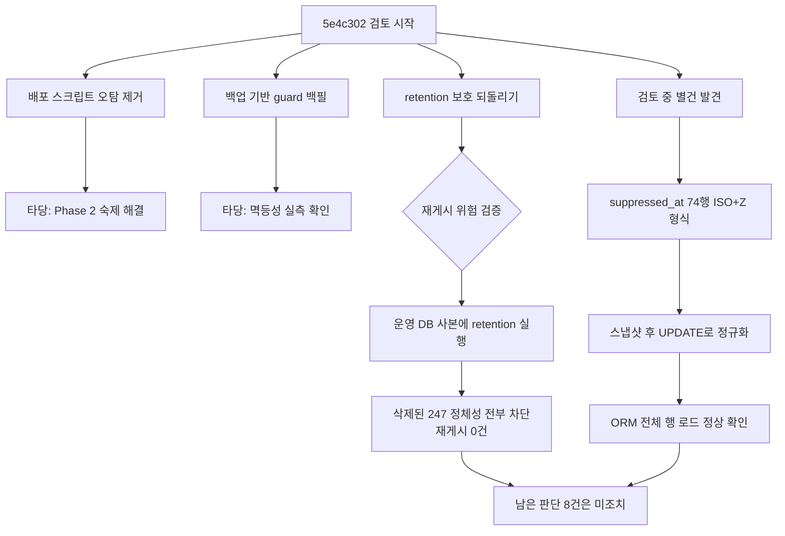

# share guard 보완 변경 검토 및 타임스탬프 정정 결과

> [!question]
> 이 문서는 **평가를 요청하는 문서**입니다. `5e4c302` / `1af07cb`에 대한 검토 결과와, 그 과정에서
> 발견해 조치한 데이터 결함 1건을 담고 있습니다.
> 판단이 필요한 항목은 [[#codex가 판단할 항목]]에 8개로 정리했고, 제가 주장한 모든 수치는
> [[#재현 명령]]으로 독립 검증할 수 있습니다.

## 목차

- [[#요약]]
- [[#검토 대상]]
- [[#검토 결과]]
- [[#조치한 것 · 타임스탬프 74건 정규화]]
- [[#조치하지 않은 것]]
- [[#codex가 판단할 항목]]
- [[#재현 명령]]
- [[#검증 수치 원본]]

## 요약

| 항목 | 결과 |
| --- | --- |
| 검토 대상 | `5e4c302`, `1af07cb` |
| 코드 변경 | **없음** (검토만) |
| 데이터 변경 | `suppressed_at` 74행 형식 정규화 |
| 새 커밋 | 없음. 워크트리 clean, `origin/main`과 동기 |
| 결론 | 세 변경 모두 방향·구현 타당. 재게시 위험 0건 실측 확인 |
| 추가 발견 | ORM이 파싱 못 하는 타임스탬프 74건 (원인은 이 세션이 아닌 오전 작업) |



## 검토 대상

```
1af07cb  docs: mark share guard hardening deployed
5e4c302  fix(shares): backfill historical re-post guards safely
```

`5e4c302`는 서로 독립적인 네 가지 변경을 한 커밋에 담고 있습니다.

| 파일 | 성격 |
| --- | --- |
| `app/repositories/notices.py` | `5bdaf9d`의 retention 보호 되돌리기 |
| `scripts/deploy-with-db-backup.sh` | `post_notices < pre_notices` 오탐 제거 + 백필 호출 추가 |
| `app/repositories/shares.py`, `app/main.py` | 신규 기능: 백업 기반 guard 백필 |
| `tests/`, `docs/` | 위 변경에 맞춘 테스트·문서 갱신 |

## 검토 결과

### 1. 배포 스크립트 오탐 제거 — 타당

`post_notices < pre_notices`를 롤백 조건에서 빼는 것은 이전 인수인계 문서에서 "Phase 2, 우선순위 높음"으로
남긴 항목입니다. retention이 정상적으로 공고를 줄이는 것을 DB 손상으로 오판해 배포 전 DB를 덮어쓰는
경로였습니다. 테이블 수 감소만 남긴 판단이 맞습니다.

### 2. 백업 기반 guard 백필 — 타당하며, 제가 놓친 구멍을 메움

`bootstrap._upgrade_schema()`의 백필은 **현재 `slack_shares`에 남아 있는 이력만** guard로 옮길 수 있습니다.
guard 테이블이 생기기 전에 이미 retention으로 삭제된 정체성은 라이브 DB만으로 복구할 수 없는데,
`backfill_share_guards_from_sqlite_backup()`이 과거 백업을 읽어 그것을 되살립니다. 설계 판단이 맞습니다.

구현도 방어적입니다. 오래된 백업에 `suppressed_at` 컬럼이 없을 수 있다는 점을 `PRAGMA table_info`로
확인하고 우회하며, `_sqlite_datetime()`이 `Z` 접미사를 `+00:00`으로 치환해 처리합니다.

> [!success]
> 멱등성 실측: 재실행 결과 `{"scanned": 22, "created": 0, "skipped": []}`.
> 기존 guard가 항상 우선하므로 배포마다 반복 실행해도 안전합니다.

### 3. retention 보호 되돌리기 — 타당. 재게시 위험 0건 실측

`5bdaf9d`(제 핫픽스)를 되돌려 제외된 공고도 일반 공고처럼 삭제합니다. 처음에는 회귀로 의심했지만
논리가 맞습니다. 제 핫픽스는 guard 테이블이 없던 시점의 임시 방편이었고, 이제 `suppress_share()`가
제외 시각·사유를 guard에 복사하므로 공고 본문을 무기한 붙잡을 이유가 없습니다.

운영 DB 사본에 retention을 실제로 실행해 검증했습니다.

| 지표 | retention 전 | retention 후 |
| --- | --- | --- |
| notices | 1,752 | 1,365 |
| slack_shares | 419 | 172 |
| slack_shares 제외 | 37 | 16 |
| **notice_share_guards** | **1,532** | **1,532** |
| **guard 제외** | **37** | **37** |
| 대기(16:00 게시분) | 1 | 1 |

핵심 검증은 이것입니다. 공고가 삭제된 **247개 정체성을 하나씩 재수집한 것처럼 넣고** `already_shared()`를
호출했더니 **247건 전부 차단, 재게시 후보 0건**이었습니다.

### 4. 영구 차단 대상 확대 — 위험 낮음으로 확인

백필로 guard가 419 → **1,532**건이 됐고, 그중 **1,112건은 대응하는 공고가 이미 없는** 되살린 이력입니다.
정상 공고가 잘못 막힐 위험을 사이트별 키 형식으로 점검했습니다.

| 사이트 | 키 예시 | 연도 재사용 |
| --- | --- | --- |
| iris | `019508:2026:S051456:43` | 없음 (연도 포함) |
| kimst | `2015000004`, `2016000030` | 없음 (연도 접두) |
| g2b | `2026EM700027806-01` | 없음 (연도 포함) |
| nia | `14629` | 없음 (일련번호) |
| kmiti | `39177` | 없음 (일련번호) |

매년 반복되는 사업이 같은 키로 재공고되는 구조가 아니므로 영구 차단의 오탐 위험은 사실상 없습니다.

### 5. 문서 갱신 — 일관성 있음

`5e4c302`의 문서 diff가 1,226줄로 보이는 것은 전면 재작성이 아닙니다. 원본이 Windows에서 만들어져
CRLF였고 이를 LF로 정규화하면서 전 줄이 변경으로 잡힌 것입니다. `--ignore-cr-at-eol`로 보면 실제
수정은 retention 설명, 검증 표, 대처 절차, `git stash push -u` 정도로 한정되며 모두 정확합니다.

## 조치한 것 · 타임스탬프 74건 정규화

> [!error]
> **이 결함의 원인은 `5e4c302`가 아니라 오전 작업입니다.** 37건을 제외 처리할 때 raw SQL로
> ISO-8601 문자열을 넣었고, `bootstrap` 백필의 `max(s.suppressed_at)`가 그 형식을 guard까지
> 그대로 복사했습니다. 둘 다 이 세션 이전에 제가 작성한 코드입니다.

### 증상

`slack_shares.suppressed_at` 37행과 `notice_share_guards.suppressed_at` 37행에 `2026-07-30T01:06:16Z`가
저장돼 있었습니다. SQLAlchemy는 SQLite `DateTime`을 `YYYY-MM-DD HH:MM:SS.ffffff`로 저장하고
`datetime.fromisoformat`으로 되읽는데, **컨테이너가 Python 3.10.12**여서 `Z` 접미사를 거부합니다.

```
ValueError: Invalid isoformat string: '2026-07-30T01:06:16Z'
```

### 왜 지금까지 안 터졌는가

전체 행을 로드하는 지점은 세 곳입니다.

| 위치 | 함수 |
| --- | --- |
| `app/repositories/shares.py:151` | `_upsert_share_guard()` |
| `app/repositories/shares.py:224` | `record_share()` |
| `app/services/scheduler.py:982` | 게시 직전 비활성 공유 조회 |

이 세 경로가 37건에 닿지 않은 이유는 우연에 가깝습니다. `already_shared()`는 `.id`만 select해서
날짜를 파싱하지 않고, 제외 대상을 다루는 쿼리(`scheduler.py:1212`, `1311`, `1353`)는 모두
`suppressed_at IS NULL`로 필터링하기 때문에 이미 제외된 37건이 후보에 들어오지 않았습니다.

> [!warning]
> 15:30 retention 이후에는 `slack_shares` 쪽 21건이 삭제되면서 **guard의 37건이 유일한 감사 기록**으로
> 남습니다. 그 유일한 기록이 앱이 읽을 수 없는 형식이었다는 점이 조치를 서두른 이유입니다.

### 조치 내용

`data/backups/app-before-timestamp-fix-20260730T054741Z.db` 스냅샷을 `Connection.backup()`으로 뜨고
원본·사본 양쪽 `integrity_check` 통과를 확인한 뒤, 두 테이블에 같은 UPDATE를 적용했습니다.

```sql
UPDATE slack_shares
   SET suppressed_at = replace(replace(suppressed_at, 'T', ' '), 'Z', '.000000')
 WHERE suppressed_at LIKE '%T%Z';

UPDATE notice_share_guards
   SET suppressed_at = replace(replace(suppressed_at, 'T', ' '), 'Z', '.000000')
 WHERE suppressed_at LIKE '%T%Z';
```

각 37행, 합계 74행이 갱신됐습니다. 서비스 재기동 없이 처리했고 코드 변경은 없습니다.

### 검증

정규화 후 이전에 예외를 던졌던 전체 행 로드가 정상 동작합니다.

```
suppressed_shares_loaded : 37
suppressed_guards_loaded : 37
sample                   : prespec:1017365 / 2026-07-30T01:06:16
                           g2b_procurement_plan_not_published
```

작업 후 상태는 `integrity ok`, notices 1,752, slack_shares 419, guards 1,532, 제외 37/37, 대기 1,
잘못된 형식 잔여 **0건**으로 변경 전과 동일합니다. `tests.test_share_guard`,
`tests.test_deferred_lifecycle` 10건 통과.

### 재발 경로 점검

| 경로 | 판정 |
| --- | --- |
| `backfill_share_guards_from_sqlite_backup()` | 안전. `_sqlite_datetime()`이 `Z`를 정상 변환 |
| `bootstrap._upgrade_schema()` 백필 | 현재는 안전. `INSERT OR IGNORE`이고 419 정체성의 guard가 이미 존재 |
| 오래된 백업 복원 후 재기동 | **위험 잔존.** `max(s.suppressed_at)` raw 복사가 형식을 그대로 옮김 |

## 조치하지 않은 것

아래는 판단이 필요해 손대지 않았습니다. 심각도는 제 평가입니다.

### A. 백필 실패가 배포 실패로 보고됨 (중간)

`scripts/deploy-with-db-backup.sh`에서 백필 호출이 `set -euo pipefail` 아래,
`echo "deploy complete"` **앞에** 있습니다.

```bash
docker compose exec -T biz-monitor-scheduler \
  python -m app.main backfill-share-guards --backup-dir /app/data/backups

echo "deploy complete; database preserved"
```

백업 개별 오류는 명령 내부에서 잡아 `skipped`로 넘기지만, 백업 디렉터리 부재나 import 오류처럼
하드 실패하면 스크립트가 non-zero로 끝납니다. **서비스는 이미 정상 기동을 마친 뒤**인데 완료 메시지가
보이지 않으므로, 운영자가 배포 실패로 읽고 불필요하게 롤백할 소지가 있습니다.

제안: `|| echo "warning: share-guard backfill failed" >&2` 로 감싸거나 완료 메시지 뒤로 이동.

### B. 백업 스캔이 무한 증가 (낮음)

현재 백업 22개·606MB이고 가지치기 로직이 없습니다. 비용은 실측상 작습니다
(`integrity_check` 개당 0.03초, 명령 전체 약 5초). 다만 배포마다 전량을 다시 읽으므로
파일 수에 선형으로 늘어납니다.

제안: mtime 기준 컷오프, 또는 이미 반영한 백업을 기록하는 표식.

### C. sqlite3 커넥션 미close (낮음)

`with sqlite3.connect(...) as conn:` 은 트랜잭션만 정리하고 커넥션을 닫지 않습니다. 실행마다 22개가
열린 채 프로세스 종료까지 남습니다. `contextlib.closing` 병용으로 해결됩니다.

### D. `immutable=1`과 stale WAL (낮음)

`file:...?mode=ro&immutable=1`은 동반 `-wal`을 무시합니다. 누군가 `cp`로 라이브 DB를 백업 폴더에
넣으면 `integrity_check`는 통과하면서 낡은 스냅샷을 조용히 읽습니다.

제안: `-wal` 형제 파일이 있는 `.db`는 건너뛰고 경고.

### E. bootstrap 백필의 형식 미보정 (낮음)

위 [[#재발 경로 점검]]의 마지막 항목입니다. `max(s.suppressed_at)`를 raw SQL로 복사하는 구조가 남아
있어, 오래된 백업을 복원하면 잘못된 형식이 다시 유입될 수 있습니다.

### F. 커밋 1개에 4가지 변경 혼재 (낮음)

`5e4c302`에 revert·배포 수정·신규 기능·문서가 섞여 있어 선택적 되돌리기가 불가능합니다.
인수인계 문서의 "부분 롤백 판단표"를 이 커밋에는 적용할 수 없습니다. 커밋 본문도 비어 있어
이 저장소의 기존 관례(변경 이유를 본문에 남김)와 다릅니다.

## codex가 판단할 항목

> [!question]
> 아래 8개는 제가 판단을 보류한 항목입니다. 동의·반대와 우선순위를 알려주세요.

1. **A 항목(배포 실패 오인)** 을 수정할지, 그리고 `|| warning` 방식과 완료 메시지 뒤로 이동 중 어느 쪽이 나은지.
2. **B 항목(스캔 증가)** 을 지금 처리할지, 백업 파일이 일정 수를 넘길 때까지 미룰지.
3. **E 항목(bootstrap 형식 미보정)** 을 SQL에서 정규화할지, 아니면 bootstrap 백필을 없애고 새
   `backfill-share-guards` 명령으로 일원화할지.
4. **타임스탬프 정정을 코드로 남길지.** 현재는 수동 UPDATE만 적용된 상태입니다. 마이그레이션이나
   일회성 명령으로 코드화하지 않으면 오래된 백업 복원 시 재발합니다.
5. **감사 기록의 정보량이 충분한지.** retention 이후 남는 것은 `site_code` + `site_notice_key` +
   `suppressed_reason`뿐이고 제목·기관·URL은 사라집니다. "왜 이 공고가 안 나갔나"에 답하기에 충분한지.
6. **영구 차단 확대(419 → 1,532)가 의도한 범위인지.** 키 형식 점검으로 오탐 위험은 낮다고 판단했지만,
   배포 스크립트가 이를 **자동·무통보**로 수행하는 구조가 맞는지.
7. **`5e4c302`를 분할할지.** 이미 push된 커밋이라 되돌리려면 history 수정이 필요하므로, 분할하지 않고
   문서로 보완하는 선택도 가능합니다.
8. **AI 추천에서 사전규격을 계속 제외할지.** 의견등록이라는 실행 가능한 액션이 있어 재검토 대상으로
   남아 있는 항목입니다.

## 재현 명령

> [!note]
> 저장소는 컨테이너에 **바인드 마운트되어 있지 않습니다**(이미지에 복사됨). `data/`만 마운트되므로
> 검증 스크립트는 `data/`에 두고 `PYTHONPATH=/app`로 실행해야 합니다. 이 점 때문에 처음 시도가
> `ModuleNotFoundError: No module named 'app'`으로 실패했습니다.

### 현재 상태 확인

```bash
ssh koast@192.168.3.60
cd /home/koast/biz-monitor
docker compose exec -T biz-monitor-scheduler python - <<'PY'
import sqlite3
c = sqlite3.connect("file:/app/data/app.db?mode=ro", uri=True)
one = lambda q: c.execute(q).fetchone()[0]
print("integrity        :", one("pragma integrity_check"))
print("notices          :", one("select count(*) from notices"))
print("slack_shares     :", one("select count(*) from slack_shares"))
print("guards           :", one("select count(*) from notice_share_guards"))
print("shares suppressed:", one("select count(*) from slack_shares where suppressed_at is not null"))
print("guards suppressed:", one("select count(*) from notice_share_guards where suppressed_at is not null"))
print("guards w/o notice:", one("""
    select count(*) from notice_share_guards g
     where not exists (select 1 from notices n
        where n.site_code = g.site_code and n.site_notice_key = g.site_notice_key)"""))
print("malformed        :", one("""
    select (select count(*) from slack_shares where suppressed_at like '%T%')
         + (select count(*) from notice_share_guards where suppressed_at like '%T%')"""))
PY
```

기대값: `ok`, 1752, 419, 1532, 37, 37, 1112, **0**.

### ORM 로드 정상 여부

```bash
docker compose exec -T -e PYTHONPATH=/app biz-monitor-scheduler python - <<'PY'
from sqlalchemy import select
from app.config import load_settings
from app.db import create_db_engine, create_session_factory
from app.models import NoticeShareGuard, SlackShare

engine = create_db_engine(load_settings().database_url)
with create_session_factory(engine)() as s:
    print("shares:", len(s.execute(select(SlackShare).where(SlackShare.suppressed_at.is_not(None))).scalars().all()))
    print("guards:", len(s.execute(select(NoticeShareGuard).where(NoticeShareGuard.suppressed_at.is_not(None))).scalars().all()))
PY
```

기대값: 37 / 37. 정정 전에는 `ValueError: Invalid isoformat string`이 발생했습니다.

### 백필 멱등성

```bash
docker compose exec -T biz-monitor-scheduler \
  python -m app.main backfill-share-guards --backup-dir /app/data/backups
```

기대값: `{"scanned": 22, "created": 0, "skipped": []}`.

### retention 리허설

운영 DB를 `backup()`으로 복사해 그 위에서 `delete_expired_notices()`를 실행하고, 삭제된 정체성을
재수집한 것처럼 넣어 `already_shared()`가 막는지 확인하는 방식입니다.

> [!warning]
> 리허설 스크립트에서 `SlackShare` / `NoticeShareGuard` **전체 행을 ORM으로 로드하지 마세요.**
> 정정 전에는 `suppressed_at` 때문에 예외가 났습니다. Core select로 필요한 컬럼만 읽으면 됩니다.

기대값: 삭제 387, shares 419 → 172, guards 1,532 유지, 재게시 후보 **0**, 대기 1 유지.

### 테스트

```bash
docker compose exec -T biz-monitor-scheduler python -m unittest \
  tests.test_g2b_lifecycle_filter tests.test_notifier \
  tests.test_deferred_lifecycle tests.test_share_guard \
  tests.test_scheduler_regression
```

기대값: 40 tests OK.

## 검증 수치 원본

### retention 리허설 (사본 대상)

```json
{
  "before": {"notices": 1752, "shares": 419, "guards": 1532,
             "shares_suppressed": 37, "guards_suppressed": 37, "pending": 1},
  "deleted_notices": 387,
  "after":  {"notices": 1365, "shares": 172, "guards": 1532,
             "shares_suppressed": 16, "guards_suppressed": 37, "pending": 1},
  "shared_identities_before": 419,
  "shared_identities_deleted": 247,
  "would_be_reposted_count": 0
}
```

### 타임스탬프 정정

```json
{
  "backup": "/app/data/backups/app-before-timestamp-fix-20260730T054741Z.db",
  "before": {"slack_shares": [["2026-07-30T01:06:16Z", 37]],
             "notice_share_guards": [["2026-07-30T01:06:16Z", 37]]},
  "updated": {"slack_shares": 37, "notice_share_guards": 37},
  "after":  {"slack_shares": {"still_malformed": 0, "sample": [["2026-07-30 01:06:16.000000"]]},
             "notice_share_guards": {"still_malformed": 0, "sample": [["2026-07-30 01:06:16.000000"]]}}
}
```

### 환경

```
Python           : 3.10.12  (fromisoformat이 Z 미지원)
백업             : 22개 .db, 606MB, 가지치기 없음
integrity_check  : 백업 개당 약 0.03초
컨테이너         : 7개 Up
워크트리         : clean, origin/main 동기
```

## 남은 관측

15:30 수집·정리 사이클과 16:00 게시가 이 문서 작성 시점 기준으로 아직 실행되지 않았습니다.
리허설로는 둘 다 정상이었고, 실제 결과는 다음 두 가지를 확인하면 됩니다.

- 15:30 이후 guards 1,532건과 guard 제외 37건이 유지되는지
- 16:00에 대기 1건(`g2b / prespec:R26BD00258247`)이 `[사전규격]` 라벨과 사전규격등록번호를 달고
  나가는지
